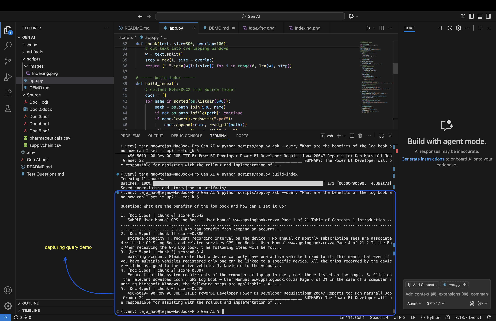

# Demo of Conversational Access System  

This file contains screenshots and short notes showing how the system works from indexing documents to answering queries.

## Step 1: Indexing the Documents  

Below is a screenshot showing how we indexed all documents into vectors and saved them in FAISS:

## Step 2: Asking a Question  

Below is a screenshot showing the system answering a natural language question from Test Questions.md:

